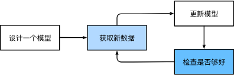
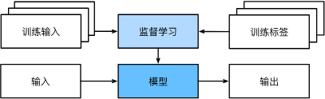

# 1 Intro

通常，即使我们不知道怎样明确地告诉计算机如何从输入映射到输出，大脑仍然能够自己执行认知功能。 换句话说，即使我们不知道如何编写计算机程序来识别“Alexa”这个词，大脑自己也能够识别它。 有了这一能力，我们就可以收集一个包含大量音频样本的_数据集_（dataset），并对包含和不包含唤醒词的样本进行标记。 利用机器学习算法，我们不需要设计一个“明确地”识别唤醒词的系统。 相反，我们只需要定义一个灵活的程序算法，其输出由许多_参数_（parameter）决定，然后使用数据集来确定当下的“最佳参数集”，这些参数通过某种性能度量方式来达到完成任务的最佳性能。

那么到底什么是参数呢？ 参数可以被看作旋钮，旋钮的转动可以调整程序的行为。 任一调整参数后的程序被称为_模型_（model）。 通过操作参数而生成的所有不同程序（输入-输出映射）的集合称为“模型族”。 使用数据集来选择参数的元程序被称为_学习算法_（learning algorithm）。

这种“通过用数据集来确定程序行为”的方法可以被看作_用数据编程_（programming with data）

## ML中的关键组件 
1. 可以用来学习的_数据_（data）；
每个数据集由一个个_样本_（example, sample）组成，大多时候，它们遵循独立同分布(independently and identically distributed, i.i.d.)。 样本有时也叫做_数据点_（data point）或者_数据实例_（data instance），通常每个样本由一组称为_特征_（features，或_协变量_（covariates））的属性组成。 机器学习模型会根据这些属性进行预测。 在上面的监督学习问题中，要预测的是一个特殊的属性，它被称为_标签_（label，或_目标_（target））。

2. 如何转换数据的_模型_（model）；
深度学习与经典方法的区别主要在于：前者关注的功能强大的模型，这些模型由神经网络错综复杂的交织在一起，包含层层数据转换，因此被称为_深度学习_（deep learning）。

3. 一个_目标函数_（objective function），用来量化模型的有效性；
在机器学习中，我们需要定义模型的优劣程度的度量，这个度量在大多数情况是“可优化”的，这被称之为***目标函数（objective function）***。 我们通常定义一个目标函数，并希望优化它到最低点。 因为越低越好，所以这些函数有时被称为***损失函数（loss function，或cost function）***。
当任务在试图预测数值时，最常见的损失函数是***平方误差（squared error）***，即预测值与实际值之差的平方。 当试图解决分类问题时，最常见的目标函数是最小化错误率，即预测与实际情况不符的样本比例。 有些目标函数（如平方误差）很容易被优化，有些目标（如错误率）由于不可微性或其他复杂性难以直接优化。 在这些情况下，通常会优化替代目标。
通常，**损失函数**是**根据模型参数定义**的，并**取决于数据集**。 在一个数据集上，我们**可以通过最小化总损失来学习模型参数的最佳值**。 该数据集由一些为训练而收集的样本组成，称为*训练数据集（training dataset，或称为训练集（training set））*。 然而，在训练数据上表现良好的模型，并不一定在“新数据集”上有同样的性能，这里的“新数据集”通常称为*测试数据集（test dataset，或称为测试集（test set））*。
可用数据集通常可以分成两部分：**训练数据集用于拟合模型参数，测试数据集用于评估拟合的模型**。 然后我们观察模型在这两部分数据集的性能。 “一个模型在训练数据集上的性能”可以被想象成“一个学生在模拟考试中的分数”。 测试性能可能会显著偏离训练性能。 当一个模型在训练集上表现良好，但不能推广到测试集时，这个模型被称为*过拟合（overfitting）*的。

4. 调整模型参数以优化目标函数的**算法（algorithm）**。
当我们获得了一些数据源及其表示、一个模型和一个合适的损失函数，接下来就需要一种算法，它能够搜索出最佳参数，以最小化损失函数。 深度学习中，大多流行的优化算法通常基于一种基本方法***梯度下降（gradient descent）***。 简而言之，在每个步骤中，梯度下降法都会检查每个参数，看看如果仅对该参数进行少量变动，训练集损失会朝哪个方向移动。 然后，它在可以减少损失的方向上优化参数。

## 各种ML问题 
### 1 监督学习(supervised learning) 
- 监督学习（supervised learning）擅长在“给定输入特征”的情况下预测标签。 每个“特征-标签”对都称为一个样本（example）。 有时，即使标签是未知的，样本也可以指代输入特征。 我们的目标是生成一个模型，能够将任何输入特征映射到标签（即预测）。
    - 举一个具体的例子： 假设我们需要预测患者的心脏病是否会发作，那么观察结果“心脏病发作”或“心脏病没有发作”将是样本的标签。 输入特征可能是生命体征，如心率、舒张压和收缩压等。
- 监督学习之所以能发挥作用，是因为在训练参数时，我们为模型提供了一个数据集，其中每个样本都有真实的标签。 用概率论术语来说，我们希望预测“估计给定输入特征的标签”的条件概率。 
- 在工业中，大部分机器学习的成功应用都使用了监督学习。 这是因为在一定程度上，许多重要的任务可以清晰地描述为，在给定一组特定的可用数据的情况下，估计未知事物的概率。比如：
    - 给出一个英语句子，预测正确的法语翻译；
    - 根据本月的财务报告数据，预测下个月股票的价格；

- **监督学习的学习过程**一般可以分为三大步骤：
1. 从已知大量数据样本中随机选取一个子集，为每个样本获取真实标签。有时，这些样本已有标签（例如，患者是否在下一年内康复？）；有时，这些样本可能需要被人工标记（例如，图像分类）。这些输入和相应的标签一起构成了训练数据集；
2. 选择有监督的学习算法，它将训练数据集作为输入，并输出一个“已完成学习的模型”；
3. 将之前没有见过的样本特征放到这个“已完成学习的模型”中，使用模型的输出作为相应标签的预测。
    

#### 回归 
**回归（regression）**是最简单的监督学习任务之一。 假设有一组房屋销售数据表格，其中每行对应一个房子，每列对应一个相关的属性，例如房屋的面积、卧室的数量、浴室的数量以及到镇中心的步行距离，等等。 每一行的属性构成了一个房子样本的特征向量。 如果一个人住在纽约或旧金山，而且他不是亚马逊、谷歌、微软或Facebook的首席执行官，那么他家的特征向量（房屋面积，卧室数量，浴室数量，步行距离）可能类似于：$[600,1,1,60]$。 如果一个人住在匹兹堡，这个特征向量可能更接近$[3000,4,3,10]$…… 当人们在市场上寻找新房子时，可能需要估计一栋房子的公平市场价值。 为什么这个任务可以归类为回归问题呢？本质上是输出决定的。 销售价格（即标签）是一个数值。**当标签取任意数值时，我们称之为回归问题**，此时的目标是生成一个模型，使它的预测非常接近实际标签值。

#### 分类
具体地说，这款应用程序能够自动理解从图像中看到的文本，并将手写字符映射到对应的已知字符之上。 这种“哪一个”的问题叫做分类（classification）问题。 分类问题希望模型能够预测样本属于哪个类别（category，正式称为类（class））。 例如，手写数字可能有10类，标签被设置为数字0～9。 最简单的分类问题是只有两类，这被称之为二项分类（binomial classification）。
当有两个以上的类别时，我们把这个问题称为多项分类（multiclass classification）问题。 常见的例子包括手写字符识别 
。 与解决回归问题不同，分类问题的常见损失函数被称为交叉熵（cross-entropy）

# 2 Prerequisites
